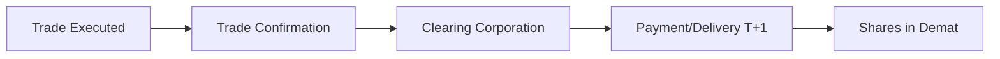

# 📚 Day 1 Morning Session: Indian Market Structure Fundamentals

## 🎯 **Learning Objectives (2 hours)**
- Understand NSE vs BSE structure and roles
- Master T+1 settlement system and implications
- Learn circuit breaker mechanisms and trader psychology
- Grasp order book dynamics and market microstructure

---

## 📈 **Section 1: NSE vs BSE - The Foundation (30 minutes)**

### **National Stock Exchange (NSE)**
- **Role**: Primary equity market, derivatives hub
- **Technology**: Fully electronic, screen-based trading
- **Key Indices**: Nifty 50, Nifty Bank, Nifty IT, Nifty Next 50
- **Trading Hours**: 9:15 AM - 3:30 PM (equity), 9:00 AM - 11:30 PM (derivatives)
- **Market Share**: ~85% of equity trading volume

### **Bombay Stock Exchange (BSE)**
- **Role**: Oldest exchange (1875), broader market coverage
- **Key Indices**: Sensex, BSE 500, BSE SmallCap, BSE MidCap
- **Unique Feature**: More listed companies (~5,500 vs NSE's ~2,000)
- **SME Platform**: BSE SME for small/medium enterprises

### **💡 Practical Implications for Your Trading**
```yaml
Day Trading:
  - Use NSE for liquid stocks (better spreads)
  - Monitor both exchanges for arbitrage opportunities
  - Focus on Nifty stocks for consistent volume

Swing Trading:
  - BSE good for discovering undervalued mid/small caps
  - NSE futures for hedging positions
  - Cross-exchange momentum signals

Long-term Investing:
  - BSE SME platform for early-stage companies
  - Index funds typically track NSE indices
  - Dividend yield hunting across both exchanges
```

---

## ⚡ **Section 2: T+1 Settlement System (30 minutes)**

### **What is T+1?**
- **T**: Trade date
- **T+1**: Settlement occurs 1 business day after trade
- **Implemented**: January 2023 (upgraded from T+2)

### **Settlement Process Flow**


### **Key Components**
1. **Clearing Corporation**: NSCCL (NSE), ICCL (BSE)
2. **Risk Management**: Mark-to-market, margin requirements
3. **Guarantee**: Clearing corp guarantees settlement

### **💡 Trading Implications**
```yaml
Cash Flow Management:
  - Money blocked immediately on purchase
  - Sale proceeds available T+1
  - Plan for settlement timing in strategy

Risk Factors:
  - Counterparty risk eliminated (clearing corp guarantee)
  - Corporate actions processed efficiently
  - Faster access to sale proceeds

Short Selling:
  - Must deliver shares by T+1
  - Auction penalties for non-delivery
  - Institutional vs retail rules differ
```

---

## 🛡️ **Section 3: Circuit Breakers & Market Psychology (30 minutes)**

### **Individual Stock Circuit Breakers**
- **5% circuit**: Applied to most stocks
- **10% circuit**: Applied to select liquid stocks
- **20% circuit**: Applied to highly liquid stocks (Nifty 50 mostly)
- **No circuit**: Derivatives, special categories

### **Index Circuit Breakers**
```yaml
Level 1 (10% drop): 15-minute halt
Level 2 (15% drop): 15-minute halt  
Level 3 (20% drop): Trading halted for the day
```

### **Market-wide Circuit Breakers (2008 implementation)**
- **Triggered by**: Nifty 50 or Sensex movement
- **Timing matters**: Different halt durations based on time of day
- **Cooling period**: Allows emotions to settle

### **🧠 Psychology & Trading Implications**
```yaml
Panic Prevention:
  - Prevents flash crashes
  - Gives time for rational decision-making
  - Reduces algorithmic trading impact

Strategic Opportunities:
  - Circuit-to-circuit moves indicate strong momentum
  - Opening after halt often shows true sentiment
  - Volume spikes near circuit levels

Risk Management:
  - Stop losses may not execute at exact levels
  - Gap openings after circuit halts
  - Liquidity issues near circuit limits
```

---

## 📊 **Section 4: Order Book Dynamics (30 minutes)**

### **Order Book Components**
```
Bid Side (Buyers)          |  Ask Side (Sellers)
Quantity | Price | Orders  |  Orders | Price | Quantity
   500   | 100.0 |   25    |    15   | 100.5 |   300
  1200   |  99.5 |   40    |    20   | 101.0 |   800
  2000   |  99.0 |   65    |    35   | 101.5 |  1500
```

### **Key Metrics to Monitor**
- **Bid-Ask Spread**: Difference between best bid and ask
- **Market Depth**: Total quantity at each price level
- **Last Traded Price (LTP)**: Most recent execution price
- **Order Imbalance**: Bid vs ask quantity ratio

### **💡 Microstructure Insights**
```yaml
Liquidity Assessment:
  - Tight spreads = high liquidity
  - Deep order book = stable prices
  - Wide spreads = be cautious with market orders

Entry/Exit Timing:
  - Large bid stacks = potential support
  - Large ask stacks = potential resistance
  - Order flow changes = momentum shifts

Slippage Prediction:
  - Calculate average depth for your order size
  - Monitor spread widening during volatility
  - Use limit orders for better fills
```

---

## 🎯 **Quick Knowledge Check (Self-Assessment)**

1. **Scenario**: You want to day trade Bank Nifty. Which exchange and why?
2. **Calculation**: If you sell ₹1L worth of shares today, when can you access the money?
3. **Strategy**: A stock hits upper circuit at 10 AM. What's your plan?
4. **Risk**: You place a market order for 10,000 shares. What should you check first?

**Expected Answers:**
1. NSE - better liquidity and derivatives market
2. T+1 day (next business day)
3. Monitor for gap up next day, check volume, assess momentum
4. Check order book depth and spread to estimate slippage

---

## 📝 **Action Items for Afternoon Session**
- [ ] Note down any concepts that need clarification
- [ ] Identify which market structure elements will be important for your trading style
- [ ] Prepare questions about how these fundamentals impact algorithmic trading
- [ ] Review the Antifragile Framework code for configuration needs

---

**⏰ Break Time**: Take 15 minutes before the afternoon technical session!